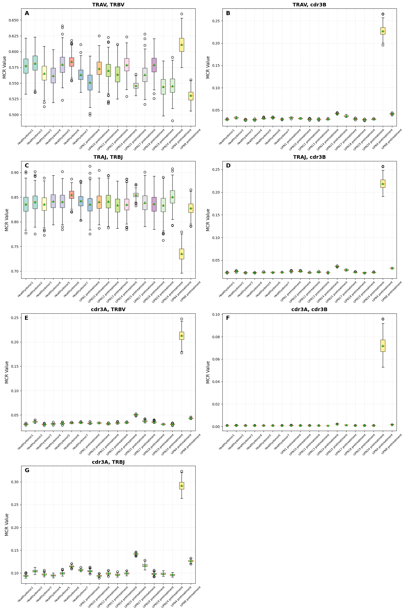
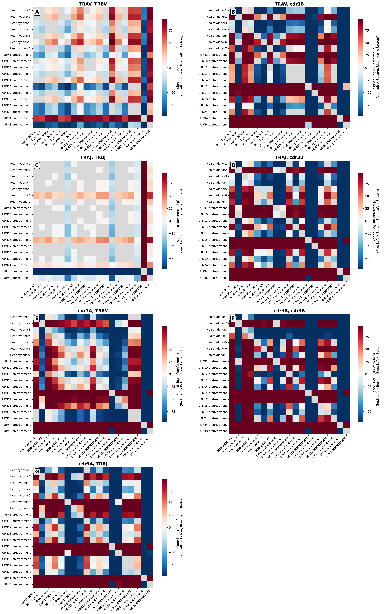
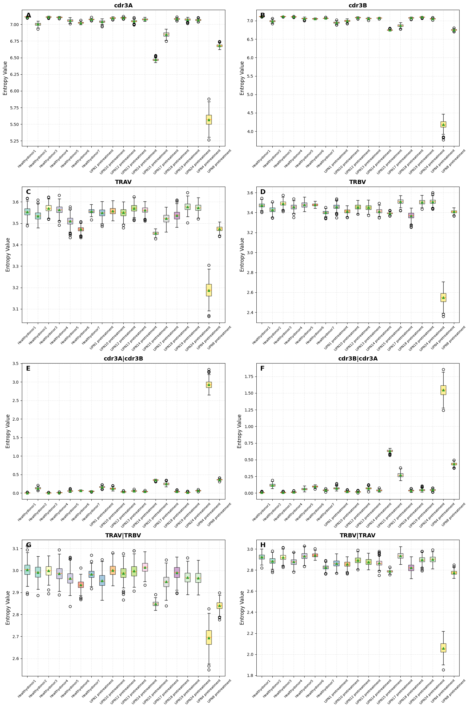
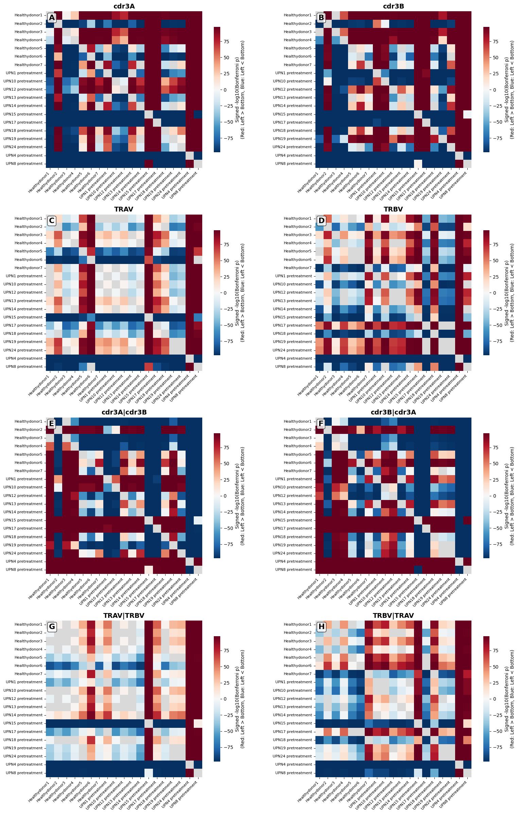

# iTCR - TCR Analysis Tools

A toolkit for T-Cell Receptor (TCR) sequence analysis based on information theory principles.

## Introduction

The ubiquity of information theory provides the ability to directly capture how knowledge of one event increases understanding of another. In this study, we developed iTCR, a tool grounded in information theory to systematically assess and interpret the complexity and informativeness of TCR αβ-chain pairing patterns. 

We formalized how paired $\alpha$ and $\beta$ chains constrain the accessible repertoire at the level of coarse-grained TCR features. Our iTCR provides two core analytical approaches:
- **MCR**: Quantifies the fraction of the theoretical diversity space that is biologically accessible. A value of $MCR \approx 1$ implies perfect independence, where the features pair randomly. Conversely, values approaching $0$ reveal strong pairing constraints between $X$ and $Y$, indicating that the accessible repertoire manifold is significantly compressed relative to the theoretical potential of combinatorial pairing.
- **PLS**: Serves as a global metric of combinatorial plasticity within the fixed germline space. A higher PLS indicates that a significant fraction of the V(J) pairing architecture has been actively reconfigured in the repertoire.

## Installation

### From PyPI (Recommended)
```bash
pip install iTCR
```
### Requirements
```bash
Python >= 3.7
numpy >= 1.22.4
pandas >= 1.5.0
matplotlib >= 3.6.3
seaborn >= 0.11.2
scipy >= 1.10.1
```
## Usage
<details open>
<summary><b>Input data</b></summary>

### Format
The input data should be a **dictionary saved in a pickle file** with the following structure:
### Data Structure
```python
    "sample_name_1": pandas.DataFrame,
    "sample_name_2": pandas.DataFrame,
    # ... more samples
```
### Required DataFrame Columns
Each DataFrame must contain the following columns:

| Column | Description | Example |
|--------|-------------|---------|
| `TRAV` | T-cell receptor alpha variable gene | TRAV1-2 |
| `TRBV` | T-cell receptor beta variable gene | TRBV19 |
| `TRAJ` | T-cell receptor alpha joining gene | TRAJ33 |
| `TRBJ` | T-cell receptor beta joining gene | TRBJ2-1 |
| `cdr3A` | CDR3 alpha amino acid sequence | CAVRDSSYKLIF |
| `cdr3B` | CDR3 beta amino acid sequence | CASSLAPGATNEKLFF |
| `(customized name)`| Frequency/probability of the TCR for down-sampling | clonotype.freq |

### Configuration File (config.json)
Users can customize which features to analyze by providing a configuration file (please visit ```iTCR/config.py```). This allows flexible control over the entropy and mutual information calculations performed by iTCR.

#### Configuration File (config.py)
``` python
{
    "SINGLE_FEATURES": ["feature1", "feature2", ...],
    "CONDITIONAL_FEATURES": [["feature1", "feature2"], ...],
    "CROSS_FEATURES": [["feature1", "feature2"], ...]
}
```
#### Default Configuration
If no configuration file is provided, iTCR uses the following default settings:
``` python
{
    "SINGLE_FEATURES": [
        "cdr3A", "cdr3B", "TRAV", "TRBV", "TRAJ", "TRBJ"
    ],
    "CONDITIONAL_FEATURES": [
        ["cdr3A", "cdr3B"], ["cdr3B", "cdr3A"],
        ["TRAV", "TRBV"], ["TRBV", "TRAV"],
        ["TRAJ", "TRBJ"], ["TRBJ", "TRAJ"]
    ],
    "CROSS_FEATURES": [
        ["TRAV", "TRBV"], ["TRAV", "cdr3B"],
        ["TRAJ", "TRBJ"], ["TRAJ", "cdr3B"],
        ["cdr3A", "TRBV"], ["cdr3A", "cdr3B"],
        ["cdr3A", "TRBJ"]
    ]
}
```
#### Feature Types Explained

- **SINGLE_FEATURES**: Individual features for entropy calculation
  - Calculates H(X) for each feature X
  - Used when `--analysis_type` includes `entropy`

- **CONDITIONAL_FEATURES**: Feature pairs for conditional entropy calculation
  - Calculates H(X|Y) for each pair [X, Y]
  - Format: `["condition_feature", "target_feature"]` means H(target|condition)
  - Used when `--analysis_type` includes `entropy`

- **MCR_FEATURES**: Feature pairs for MCR calculation
  - Calculates MCR(X,Y) for each pair [X, Y]
  - Order doesn't matter as MCR(X,Y) = MCR(Y,X)
  - Used when `--analysis_type` includes `mcr`
</details>

<details open>
<summary><b>Command Line Interface Overview</b></summary>
<pre><code class="language-bash"># General usage
python3 -m iTCR [command] [options]
# Or using the installed command
itcr [command] [options]
</code></pre>

### Available Commands
<pre><code class="language-bash">mcr                   - Entropy and MCR analysis
PLS                   - V(J)-gene Pairing Landscape Shift analysis
mcr-display           - Display MCR results
entropy-display       - Display entropy results
</code></pre>
</details>

<details open>
<summary><b> Analysis Modules </b></summary>

### 1. Manifold Coverage Ratio (MCR) Analysis
<details> <summary><b>Analysis usage</b></summary>

### Basic command
This module calculates entropy and MCR between different TCR features (V genes, J genes, CDR3 sequences).
<pre><code class="language-bash">python3 -m iTCR mi --inputfile data.pickle --outputdir results/ [options]
</code></pre>
### Paramenters

| Parameter | Type | Default | Description |
|-----------|------|---------|-------------|
| `--inputfile` | str | Required | Path to input pickle file containing TCR data |
| `--outputdir` | str | Required | Output directory for results |
| `--analysis_type` | str | both | Type of analysis: entropy, mcr, or both |
| `--sample_times` | int | 300 | Number of down-sampling times |
| `--sample_weights` | str | clonotype.freq | Sample weights method |
| `--outer_jobs` | int | 8 | Number of parallel outer permutation tasks; if your cores < 64, you should set it smaller. |
| `--inner_jobs` | int | None | Number of cores per permutation task |
### Examples
```python
# Calculate entropy for TRAV region
python3 iTCR analysis \
    --inputfile tcr_data.pickle \
    --outputdir example_outputs/ \
    --analysis_type both \
    --sample_times 300 \
    --sample_weights clonotype.freq
```
</details>

<details> <summary><b>Output files</b></summary>

- entropy.pickle: Entropy values 
- mcr.pickle: MCR values

</details>

### 2. V(J)-gene Pairing Landscape Shift (PLS) Analysis
<details> <summary><b>PLS analysis usage</b></summary>
The PLS module is a two-step pipeline that quantifies repertoire remodeling between biological conditions (e.g., pre- vs. post-treatment, different timepoints) by analyzing V(J)-gene pairing patterns.

#### Pipeline Overview

**Step 1: Calculate Normalized Pointwise Information (NPMI)**
- Computes NPMI matrices for V-gene and J-gene pairs
- Uses bootstrap sampling to generate robust estimates
- Quantifies local coupling strength for each gene pair

**Step 2: Analyze Timepoint Changes**
- Performs statistical testing between conditions
- Applies dual-criterion filtering (FDR and effect size)
- Calculates PLS as the proportion of significantly shifted gene pairs

#### Sample Naming Convention (IMPORTANT)  
**⚠️ Before running PLS analysis, you MUST configure your sample naming convention in your inputdata.**  
PLS analysis requires specific sample ID formats to identify paired samples (e.g., pre- vs. post-treatment):  
**Required Sample ID Format:**  
patient_id pretreatment    # Pre-treatment sample  
patient_id posttreatment   # Post-treatment sample  
**Examples:**
UPN1 pretreatment, UPN1 posttreatment, UPN4 pretreatment, UPN4 posttreatment

#### Customizing Sample Metadata  
**Step 1: Locate the configuration file**  
The sample parser configuration is located at:
```iTCR/analysis/sample_parser.py```  
**Step 2: Modify the `create_sample_mapping()` function**

Edit this function to match your patient metadata:

```python
def create_sample_mapping():
    """
    Create sample mapping dictionary
    MODIFY THIS FUNCTION according to your sample naming convention
    
    Returns:
    --------
    dict: Mapping of patient IDs to their metadata
    """
    return {
        "patient_id_1": {
            "pre": "Pre",
            "posttreatment": "timepoint_info",
            "metadata_field_1": "value1",
            "metadata_field_2": "value2",
            # Add more metadata fields as needed
        },
        "patient_id_2": {
            "pre": "Pre",
            "posttreatment": "timepoint_info",
            "metadata_field_1": "value1",
            "metadata_field_2": "value2",
        },
        # Add more patients...
    }
```
Example configuration  
```python
def create_sample_mapping():
    return {
        "UPN1": {
            "pre": "Pre",
            "posttreatment": "3M_CR",
            "cmv_status": "Positive",
            "3M_response": "CR",
            "6M_response": "CR"
        },
        "UPN4": {
            "pre": "Pre",
            "posttreatment": "3M_PR",
            "cmv_status": "Positive",
            "3M_response": "PR",
            "6M_response": "Relapsed"
        },
        "UPN6": {
            "pre": "Pre",
            "posttreatment": None,  # No post-treatment sample
            "cmv_status": "Negative",
            "3M_response": "NR",
            "6M_response": "NE, off"
        },
        # Add more patients...
    }
```
**Data Structure Requirements**  
Your input pickle file should contain a dictionary where:  
- Keys: Sample IDs following the naming convention (e.g., "UPN1 pretreatment")  
- Values: DataFrames with required TCR columns (TRAV, TRBV, TRAJ, TRBJ, cdr3A, cdr3B, frequency column)  
Example:
```python
{
    "UPN1 pretreatment": DataFrame(...),
    "UPN1 posttreatment": DataFrame(...),
    "UPN4 pretreatment": DataFrame(...),
    "UPN4 posttreatment": DataFrame(...),
    # ...
}
```

### Basic Command
```python
python3 -m iTCR PLS --inputfile data.pickle --outputdir results/ [options]
```
### Parameters

| Parameter | Type | Default | Description |
|-----------|------|---------|-------------|
| **Input/Output** | | | |
| `--inputfile` | str | Required | Path to input pickle file |
| `--outputdir` | str | Required | Output directory for results |
| **Step 1: NPMI Calculation** | | | |
| `--sample_times` | int | 300 | Number of bootstrap samples |
| `--sample_weights` | str | clonotype.freq | Column name for sampling weights |
| `--outer_jobs` | int | 4 | Number of parallel outer tasks |
| `--inner_jobs` | int | None | Number of cores per task (auto) |
| `--base` | float | e | Logarithm base for NPMI calculation |
| **Step 2: Statistical Analysis** | | | |
| `--n_permutations` | int | 10000 | Number of permutations for testing |
| `--n_jobs` | int | -1 | Number of parallel jobs (-1 = all cores) |
| **Pipeline Control** | | | |
| `--skip_step1` | flag | False | Skip Step 1 and use existing NPMI results |
| `--only_step1` | flag | False | Only run Step 1 (NPMI calculation) |


### Examples

**Full Pipeline**
```python
# Run complete PLS analysis
python3 -m iTCR PLS \
    --inputfile tcr_data.pickle \
    --outputdir pls_results/ \
    --sample_times 300 \
    --n_permutations 10000
```
**Step-by-Step Execution**
```python
# Step 1 only: Calculate NPMI
python3 -m iTCR PLS \
    --inputfile tcr_data.pickle \
    --outputdir pls_results/ \
    --only_step1 \
    --sample_times 300

# Step 2 only: Analyze changes (requires existing NPMI results)
python3 -m iTCR PLS \
    --inputfile tcr_data.pickle \
    --outputdir pls_results/ \
    --skip_step1 \
    --n_permutations 10000
```
</details>

<details> <summary><b>Output files</b></summary>

**Step 1 Output** 

```npmi.pickle```: NPMI matrices for all V(J)-gene pairs across bootstrap iterations

**Step 2 Output**
- ```patient_PLS_detailed.pickle```
- ```patient_PLS_summary.csv```
</details>


### 3. Results Visualization
We provide the visualization for MI and entropy results generated by the "analysis" module.
<details> <summary><b>Display Commands for MCR results</b></summary>

### Features
- **Statistical Testing**: Performs pairwise Mann-Whitney U tests between samples
- **Multiple Testing Correction**: Supports FDR and Bonferroni correction methods
- **Combined Visualizations**: Creates multi-panel boxplots and heatmaps
- **Flexible Analysis**: Customizable feature pairs and test parameters
- **Batch Processing**: Support for automated analysis without display

### Usage

#### Basic Usage
```bash
# Analyze with default settings
python3 -m iTCR mcr-display --mcr_path results.pickle
```
#### Advanced Options
```bash
# Use FDR correction with custom significance threshold
python3 -m iTCR mcr-display --mcr_path results.pickle --adjust_method FDR 

# Custom feature pairs
python3 -m iTCR mcr-display --mcr_path results.pickle --features "TRAV,TRBV;cdr3A,cdr3B"
```

### Parameters

| Parameter | Type | Default | Description |
|-----------|------|---------|-------------|
| `--mcr_path` | str | Required | Path to pickle file containing MCR data |
| `--save_dir` | str | figures/MCR_analysis | Directory to save output figures |
| `--features` | str | None | Custom feature pairs ("feat1,feat2;feat3,feat4") to display|
| `--adjust_method` | str | Bonferroni | Multiple testing correction (FDR/Bonferroni) |
| `--no_adjust` | flag | False | Skip multiple testing correction |
| `--significance_threshold` | float | 0.05 | P-value threshold for significance |
| `--no_display` | flag | False | Batch mode without plot display |
| `--output_results` | str | None | Save statistical results to CSV file |
| `--verbose` | flag | False | Enable detailed output |

### Default Feature Pairs

The analysis includes these TCR feature combinations by default:

- `TRAV, TRBV` - Alpha and beta V genes
- `cdr3A, cdr3B` - Alpha and beta CDR3 sequences
- `TRAV, cdr3B` - Alpha V gene with beta CDR3
- `cdr3A, TRBV` - Alpha CDR3 with beta V gene
- `TRAJ, TRBJ` - Alpha and beta J genes
- `cdr3A, TRBJ` - Alpha CDR3 with beta J gene
- `TRAJ, cdr3B` - Alpha J gene with beta CDR3

### Statistical Analysis
#### Multiple Testing Correction
- **Bonferroni**: Conservative correction for multiple comparisons
- **FDR**: False Discovery Rate (Benjamini-Hochberg) correction
- **None**: Raw p-values without correction

### Output Files
#### Visualizations
- `combined_boxplots.pdf` - Multi-panel boxplots showing MI value distributions
- `combined_heatmaps.png` - P-value heatmaps with significance annotations

#### Statistical Results (Optional)
- CSV file with columns: Feature1, Feature2, Sample1, Sample2, P_Value_Raw, P_Value_Adjusted, Test_Direction_Used, N_Sample1, N_Sample2

### Interpretation
#### Boxplots
- Show MCR value distributions across samples for each feature pair
- Colored boxes represent different samples
- Means are indicated by markers
- Lower MCR values suggest stronger feature associations

#### Heatmaps
- Gray cells represent no significant ($p \ge 0.05$).
- Colored cells represent significant diferences ($p < 0.05$). Red: The sample on the Left (Row) has a HIGHER value than the sample on the Bottom (Column). Blue: The sample on the Left (Row) has a LOWER value than the sample on the Bottom (Column).


### Example Output
<p align="center">
  
  
</p>

</details>

<details> <summary><b>Display Commands for entropy results</b></summary>
The `entropy_display.py` module provides comprehensive visualization and statistical analysis tools for Entropy data generated by TCR analysis.

### Features

- **Statistical Testing**: Performs pairwise Mann-Whitney U tests between samples
- **Multiple Testing Correction**: Supports FDR and Bonferroni correction methods
- **Combined Visualizations**: Creates multi-panel boxplots and heatmaps
- **Flexible Analysis**: Customizable entropy features and test parameters
- **Batch Processing**: Support for automated analysis without display

### Usage

#### Basic Usage
```bash
# Analyze with default settings
python3 iTCR entropy-display  --entropy_path entropy.pickle
```
#### Advanced Options
```bash
# Use FDR correction with custom significance threshold
python3 iTCR entropy-display --entropy_path entropy.pickle --adjust_method FDR

# Custom entropy features
python3 iTCR entropy-display --entropy_path entropy.pickle --features "cdr3A;cdr3B;TRAV|TRBV"
```
### Parameters

| Parameter | Type | Default | Description |
|-----------|------|---------|-------------|
| `--entropy_path` | str | Required | Path to pickle file containing Entropy data |
| `--save_dir` | str | figures/Entropy_analysis | Directory to save output figures |
| `--features` | str | None | Custom entropy features ("feat1;feat2;feat3\|feat4") to display|
| `--adjust_method` | str | Bonferroni | Multiple testing correction (FDR/Bonferroni) |
| `--no_adjust` | flag | False | Skip multiple testing correction |
| `--significance_threshold` | float | 0.05 | P-value threshold for significance |
| `--no_display` | flag | False | Batch mode without plot display |
| `--output_results` | str | None | Save statistical results to CSV file |
| `--verbose` | flag | False | Enable detailed output |

### Default Entropy Features

The analysis includes these TCR entropy features by default:

- `cdr3A` - Alpha CDR3 entropy
- `cdr3B` - Beta CDR3 entropy
- `TRAV` - Alpha V gene entropy
- `TRBV` - Beta V gene entropy
- `cdr3A|cdr3B` - Conditional entropy of alpha CDR3 given beta CDR3
- `cdr3B|cdr3A` - Conditional entropy of beta CDR3 given alpha CDR3
- `TRAV|TRBV` - Conditional entropy of alpha V gene given beta V gene
- `TRBV|TRAV` - Conditional entropy of beta V gene given alpha V gene

### Statistical Analysis
#### Multiple Testing Correction
- **Bonferroni**: Conservative correction for multiple comparisons
- **FDR**: False Discovery Rate (Benjamini-Hochberg) correction
- **None**: Raw p-values without correction

### Output Files

#### Visualizations
- `combined_entropy_boxplots.pdf` - Multi-panel boxplots showing entropy value distributions
- `combined_entropy_heatmaps.png` - P-value heatmaps with significance annotations

#### Statistical Results (Optional)
- CSV file with columns: Feature, Sample1, Sample2, P_Value_Raw, P_Value_Adjusted, Test_Direction_Used, N_Sample1, N_Sample2, Mean_Sample1, Mean_Sample2, Std_Sample1, Std_Sample2

### Interpretation
#### Boxplots
- Show entropy value distributions across samples for each feature
- Colored boxes represent different samples
- Means are indicated by markers
- Higher entropy values suggest greater diversity/uncertainty

#### Heatmaps
- Gray cells represent no significant ($p \ge 0.05$).
- Colored cells represent significant diferences ($p < 0.05$). Red: The sample on the Left (Row) has a HIGHER value than the sample on the Bottom (Column). Blue: The sample on the Left (Row) has a LOWER value than the sample on the Bottom (Column).

### Example Output
<p align="center">
  
  
</p>

</details>